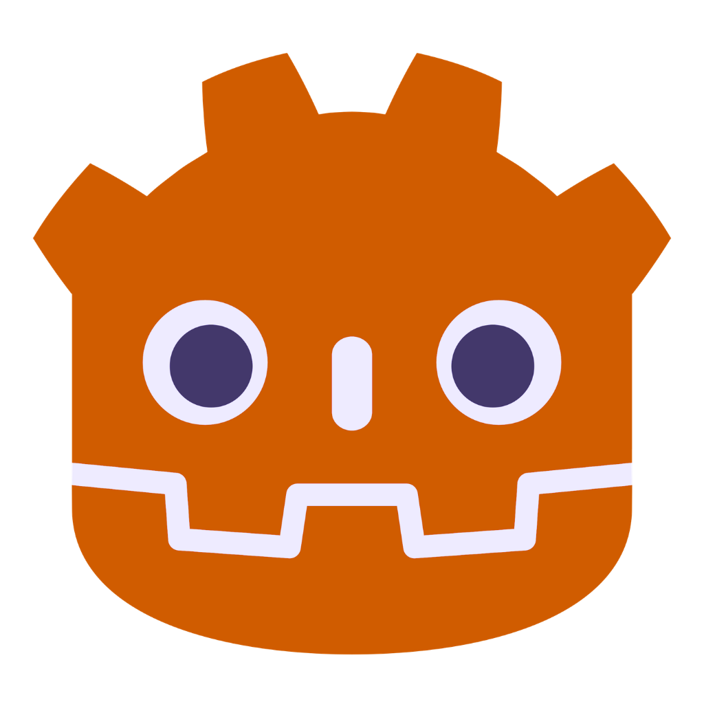

# Arjun's Asset Hub

A growing collection of game-development and animation assets ranging from beginner-friendly to advanced.

I designed these projects to be easy to download, test, understand, and customize.

[Visit the Asset Hub](https://ar-bh.github.io/arjuns-asset-hub/)

## What's included :)

### 3D Godot 4

- [Advanced Physics Simulator](https://github.com/ar-bh/advanced-physics-simulator) — a first-person physics playground where you can grab, throw, push, and destroy objects.
- [Basic FPS Controller](https://github.com/ar-bh/basic-fps-controller-godot) — walking, sprinting, jumping, mouse look, and a graybox test map.
- [3D Platformer](https://github.com/ar-bh/3d-platformer-godot) — a third-person controller with an orbital camera and animated Gobot character.
- [Marble Run Controller](https://github.com/ar-bh/marble-run-controller) — a physics-based marble controller with an orbital camera.
- [3D Bear Controller](https://github.com/ar-bh/3d-bear-controller) — an animated third-person bear controller.
- and more to come!

### 2D Godot 4

- [Basic 2D Platformer](https://github.com/ar-bh/basic-2d-platformer) - a beginner-friendly platformer with walking, sprinting, jumping, coyote time, animations, and Kenney pixel playgrounds

### LEGO Blender

Downloadable and personal LEGO-style creations made with Mecabricks and Blender (all custom-made by me, Arjun).

However, some projects are private, unfinished, unofficial fan creations, or unavailable for download. Read each project's page before using an asset.

### Fonts

- **_Augie Pixel_** - the pixel font used throughout this website, created by Augie (on Slack) for Hack Club's Jame Gam.

## Using Arjun's Asset Hub

1. Open the [Asset Hub](https://ar-bh.github.io/arjuns-asset-hub/)
2. Select **Asset Store**
3. Choose a category (`3D Godot 4`, `LEGO Blender`, etc.)
4. Download the file directly, open its GitHub repository, or copy its Git clone command.
5. Follow the steps in its corresponding README to get started and learn more about the asset and how to use it.

Godot projects include test maps and editable Inspector settings. Be sure to check each project's README for installation instructions, controls, licenses, and credits before using it.

## Featured projects

Projects marked with an orange glow and star are some of my current favorite projects. That's why this list is always changing! Featured projects also appear on the Home page.

## Licenses and credits

Licenses vary between projects. For more information, see each project's README.

Some included third-party artwork may have separate restrictions, including non-commercial-use requirements. Always read the license and credits included with an asset before using it. This is mentioned so many times because it is **extremely important**.

Notable resources include:

- [Godot Engine](https://godotengine.org/)
- [Kenney](https://kenney.nl/) assets
- [GDQuest Gobot](https://github.com/GDQuest/godot-4-3D-Characters)
- Mecabricks and Blender
- Augie Pixel by Augie

## Feedback and requests

Found a bug or have an idea for another asset?

[Open an issue](https://github.com/ar-bh/arjuns-asset-hub/issues) or visit the related project’s GitHub repository.

## About

Made by Arjun Bhumula (2026, @14) to help beginners start creating games and animations.
Made for Hack Club's Stardance Challenge. More assets will be released periodically, although there is no guarantee and chances are they will **not** be for Hack Club's Stardance Challenge.

### Version v2.0.0

### Arjun's Asset Hub v2.0 - Bigger Store Updates and Quality of Life improvements
